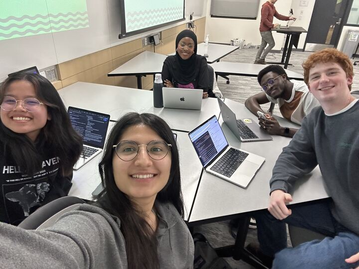

# Project Name

[*how?*](https://help.github.com/articles/about-readmes/#relative-links-and-image-paths-in-readme-files)
Scafolding:

Project Description:

"Lost and Found" is a web app where you send anonymous messages as paper airplanes that land on random spots across a world map for others to discover. Each day, unlock a new country to scratch off, explore fun facts, and uncover hidden messages. Collect unique stamps for your virtual passport as you complete countries and unlock achievements, creating a personalized journey of global stories and connections.

## Architecture

tools: react, redux, mongo/mongoose, zustand

## Setup

npm install 

## Deployment

npm run dev

## Authors

Yasmeen Hussein
Peipei Soeung
Cinay Dilibal
Thomas Clark

## Acknowledgments

